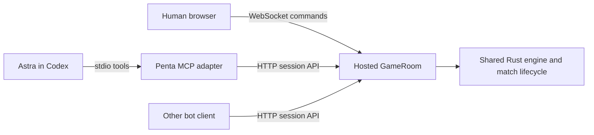

# Bot sessions and MCP

Penta's hosted room owns one authoritative engine and match journal. A browser,
an ordinary HTTP bot, and the stdio MCP adapter all connect to that room. Either
engine seat can be driven by a bot; one can also be the existing human browser.
The MCP adapter supplies transport and presentation, with no model calls,
gameplay policy or action ranking. The engine advances unique continuations
without asking a client to acknowledge them.



This is an opt-in hosted mode, `sessionApi: true`, with an external opponent.
It returns every real choice to the controlling client, including optional mana
abilities. A sole pass, completed combat declaration, or decision with exactly
one valid selection advances automatically. Multi-selection templates are not
treated as single choices; selection bounds, ordering, cancellation, and offered
casts all matter. Concession remains a separate way to end a game, not an
alternative continuation for this check. Browser auto-pass and phase-stop
controls are disabled. No move clock is imposed. Existing indexed bot-protocol
vocabulary and legality remain unchanged.

## Run locally

Start the current worktree's web server using the [web setup](../web/README.md).
Hosted routes must be enabled on the server (`HOSTED_GAMES=enabled`, already
configured for local development). Install the separate adapter's dependencies
from the repository root:

```sh
pnpm --dir tools/penta-mcp install --frozen-lockfile
```

Register the stdio server with Codex from the repository root:

```sh
codex mcp add penta -- node "$(pwd)/tools/penta-mcp/server.mjs"
```

Use an absolute script path. The adapter finds that worktree's assigned server
port, including `PENTA_DEV_PORT` overrides, independently of the caller's working
directory. For another deployment, add `--env PENTA_SERVER_URL=https://your-host`
before `--` when registering. The adapter requires Node 22.13 or newer.
It speaks MCP on stdout; it does not launch the web server or install
itself into Codex. See [Codex MCP configuration](https://developers.openai.com/codex/mcp/)
for client setup. `make penta-mcp` is an equivalent local stdio entry point.

With the web server running, verify stdio discovery and backend reachability:

```sh
node tools/penta-mcp/probe.mjs
```

Restart/reconnect the MCP integration if the client has not discovered it.
Verify the actual pilot has callable `attach`, `choose`, `next`, `inspect_ref`,
and `retry` tools before starting a timed game. The probe verifies transport;
it does not expose tools inside an already-running pilot task. Invoke tools
directly during play. The repository's
[play-penta skill](../.agents/skills/play-penta/SKILL.md) covers the protocol
without gameplay advice or mandatory per-move narration.

## Start and play

1. Call `options` to discover registered formats and deck names.
2. Call `start_match` with `format`, `p1Deck`, and `p2Deck`. `matchMode` defaults
   to `first-to-two-wins`; `one-conclusion` is also supported. The room rolls a
   private seed. No client receives it during play.
3. Give each player only its own `{room, token}` from `seats.p1` or `seats.p2`.
   Each calls `attach` and retains its returned `connection` handle.
4. At `status: "ready"`, submit `play` with that view's `revision` and an exact
   choice. `play` applies the request and waits for the same seat's next choice.
   If it returns `waiting`, call `next`. Both tools wait up to 25 seconds per
   call; `waitMs: 0` returns immediately.
5. Stop at `complete`. Use `inspect(section: "record")` for the complete replay.

For human versus Astra, include `humanSeat: "p1"` or `"p2"` in `start_match`.
Open the returned `humanUrl` in a browser and give Astra the other seat's
credential. The URL carries only the human credential in its fragment. The
browser saves it in tab session storage, removes the fragment, and rejoins the
existing room on refresh. The start result itself belongs to the organizer;
giving both credentials to one player would give it access to both hands.

The historical `human` and `bot` connection-role names describe adapters, not
engine player numbers. `humanFirst` at room creation maps the `human` role to
`p1` when true and `p2` when false. The canonical observation's `seat` identifies
the actual player; choosing play or draw does not exchange player identities.

Example tool arguments after attaching:

```json
{"connection":"...","revision":"...","choices":[{"index":3}]}
```

An explicit engine decision takes ordered option IDs:

```json
{"connection":"...","revision":"...","choices":[{"decision":12,"options":[4,2]}]}
```

An action can also be submitted as the complete legal-action object with only
its `index` removed. Every field must match exactly. For a batch, provide up to
64 such action values or explicit decisions. The server resolves each against
the fresh engine state after forced advancement, in order, and stops at the first
unavailable choice or other seat's decision. It returns `receipt.accepted` and, when stopped early,
`receipt.stopped`. An accepted prefix remains committed. Indexed choices are
allowed only for a single move; a batch cannot reuse changing list positions.
The adapter never invents, extends, or resumes a batch. Each submitted choice
includes its engine-forced continuations; `receipt.accepted` counts submitted
choices only. Forced actions are reconstructed deterministically from the
journal's commands and simulation fingerprint.

## Compact observations

The HTTP API returns canonical seat observations, including their reconstruction
checkpoint and match state. The MCP playing view separates the checkpoint into
`inspect(section: "checkpoint")` and returns one compact JSON text block.
For subsequent observations it chooses whichever is shorter: a full playing
view or exact JSON changes against `baseRevision`. Property paths are literal
arrays of keys; `remove: true` deletes a property, otherwise `value` replaces it.
For arrays of the same length, paths can include numeric-string indices, such
as `["battlefield", "2", "tapped"]`. Length changes replace the entire array,
retaining order without splicing or holes. A whole replacement is also used
when it is smaller than individual edits. Request `next(full: true)` or
`inspect(section: "observation")` to reset the presentation baseline.

Menus with more than 100 entries or 12,000 JSON characters become explicit
counts and inspect references.
`inspect(section: "legalActions")` and `inspect(section: "decision")` return
pages with `offset`, `total`, and `nextOffset`, retaining engine IDs and order.
An optional `query` searches their JSON text; `actionType` filters by the exact
type the caller requests. No option is ranked, recommended, or silently dropped.
The full menu remains available through the HTTP observation. Inspect pages
stop at 24,000 item characters or the requested limit, whichever comes first;
a single larger item is returned intact so paging always makes progress.

`inspect(section: "catalog", definitions: [...])` accepts the catalog's canonical
printing UUID strings (protocol 32), rather than numeric definition IDs. It
retrieves public card definitions, rules text, and structured metadata. A name
`query` is also available. The adapter caches the public catalog outside model context, and
sends only the requested page. `inspect(section: "match")` gives exact match
details. A waiting response exposes neither another seat's intermediate
observation nor a revision that could reveal private choice counts.

Session observations add ordered `updates`: public events and `AutomaticDecision`
entries containing frozen seat-visible questions and their forced answers.
This preserves transient reveals, including a card revealed into an opponent's
hand, and private inspections that no longer require an acknowledgement. Seeds
and other seats' private inspection menus are withheld. Public notices retain
their redaction. Face-down spell events carry a public object ID and `faceDown`
marker without a card name or definition. The browser also includes skipped
inspection information in its game log.

Updates accumulate until that seat's next successfully submitted move. Reading,
waiting, reconnecting, and retrying a committed request do not consume them.
Read or inspect referenced updates before submitting the next move. A batch
retains updates from every accepted command; split a batch when intermediate
information should affect a later choice. Large update lists use the same
explicit count and `inspect(section: "updates")` paging contract
as menus. The ordinary canonical observation also adds `forcedAction` and the
optional `actions.forced.v1` capability so other runners can use the same engine
classification without opting into hosted automatic advancement.

Transport savings do not imply a particular reduction in model reasoning cost.
Compare total tool input/output, follow-up inspections, reasoning usage, and
wall time on the same match workload before claiming overall token savings.
`tools/penta-mcp/measure-trace.mjs` measures presentation characters on supplied
observation traces without invoking a model or changing any game decisions.

## Current decision views and tickets

For model play, opt into `decision-v1` when attaching:

```json
{"room":"...","token":"...","presentation":"decision-v1"}
```

Each ready response contains the current situation, player state, position,
ordered updates, and every legal choice. No earlier patch baseline is needed.
Objects and choices carry descriptive labels alongside exact engine fields.
Repeated equal fields may be factored into `{shared, rows}` tables: apply
`shared` to every row. Array order and missing/null/false/zero distinctions are
preserved. Unknown observation fields remain in `facts`. Canonical provenance
and checkpoint data are available through the view's explicit reference.

Each choice carries a revision-bound opaque `ticket`. Submit one concrete move
with `choose`; connection, revision, and request ID stay in the adapter:

```json
{"ticket":"example:a8"}
```

A decision ticket requires an explicit array of the selected **option IDs**,
in the intended order; omission is an error even when `[]` is allowed:

```json
{"ticket":"example:a0","options":[4,2]}
```

The engine validates the stored revision and exact choice again. No action is
ranked or inferred from a label. Optional mana actions and all genuine choices
remain present. `choose` uses the same play-and-wait behavior as `play`.

Oversized sections and printed card bodies carry opaque references. Read them
with `inspect_ref({reference, offset, limit})`; follow `nextOffset` for more.
These references read the frozen issuing view without requesting a newer
position. A new position or `next(full: true)` expires the prior view's tickets
and references. Waiting retains the last seat-safe inspection view without
revealing opponent revisions or enabling its old actions.

First-seen visible definitions include printed rules text within an inline
budget. All visible definitions have a lookup entry; unavailable catalog text
is explicit. Full refresh can resend text after context loss. Printed text is
reference material: observed copy, face, token, chosen-value, and ability data
remain separate and authoritative for current state. The adapter does not
calculate effective rules or identify hidden cards using the catalog.

Repeat an identical retained ticket and option array to recover its receipt,
including after a lost response. Different commands are blocked while an
outcome is uncertain; `retry({connection})` also resolves it. The adapter retains
only the latest submitted ticket per connection, plus the current view. Changed
selections and stale tickets fail explicitly. Reattach after process loss;
cross-process uncertain-request recovery still requires the saved exact body
and request ID described below.

The default `exact` presentation, explicit `play` batches, and raw `inspect`
remain available. `inspect(section: "observation")` always supplies the exact
playing observation. `decision-v1` checks session API 1 and bot protocol 32;
it does not change HTTP, checkpoint, or replay schemas. See the
[implementation note](design-notes/model-facing-bot-interface.md) for the field
mapping and remaining controlled-evaluation work. No Astra token or wall-clock
improvement has yet been measured for this presentation.

## HTTP contract and recovery

The session envelope has `apiVersion: 1`. Public setup discovery is
`GET /_engine/options`. Room routes below use `/_game/<room>/` and authenticate
with the bearer seat credential in `x-penta-token`:

| Route | Request | Response |
| --- | --- | --- |
| `start` | POST `format`, `humanDeck`, `botDeck`, `humanFirst`, `seed`, `botPolicy: "external"`, `sessionApi: true`, optional `matchMode` | Initial browser state and both credentials, once; server replaces `seed` |
| `session?wait=25000` | GET | `waiting`, or `ready`/`complete` with opaque `revision` and canonical `observation` |
| `play?wait=25000` | POST `{revision, requestId, choices}` | Same envelope plus accepted-prefix `receipt` |
| `catalog` | GET | Public format catalog |
| `record` | GET after completion | Configuration and command journal with replay compatibility metadata |

Use a new `requestId` for each logical play. If a call times out or its outcome
is uncertain, resend the identical body and ID. The room serializes writes and
durably records the latest receipt for each role with its commands. Repeating
that request returns the receipt without applying it twice, including after
room eviction. A different body with the same ID, or an outdated revision for a
new request, is rejected with HTTP 409. Observe again after a stale refusal.
Older receipts are not retained after a later request by that seat; clients
must resolve an uncertain play before issuing the next one.

The MCP `retry` tool retains and resends the exact pending request after network
or server failure. New moves are refused until that uncertainty is resolved.
The handle and pending-request cache last for the adapter process. A new
process can reattach using the saved room and seat token; HTTP clients needing
recovery across their own crash should persist the pending body before sending.
Room creation is separate from play retries: if the initial `start_match`
response is lost, its credentials cannot be recovered through the adapter.

Browser commands and exact session requests share the same revision check and
journal. The room retains its last safe human projection during private bot
choices. Exact-session records are unavailable to either seat until match
completion, including the registered deck names. Legacy external-game records
withhold the seed and journal while playing. After completion either seat may
fetch the credential-free replay. Exact sessions use browser/host replay
version 4, which refuses older version-2 and version-3 journals.
Bot protocol and checkpoint versions do not change for this adapter.

The bot role can also attach to an existing external hosted game without
`sessionApi`; that game retains its existing browser pacing and clock behavior.
Both-role exact control requires a newly created `sessionApi` room.

## Validation

```sh
make test-penta-mcp
make test-bot-sessions
make test-wasm-rust FILTER=session_api
make test-web-wasm-contract PATTERN='session API'
```

Tests cover native observation parity, explicit priority windows, menu paging,
exact delta reconstruction, stdio MCP negotiation, request and storage retries,
concurrent commands, credential separation, browser refresh, sideboarding, and
reconstructing a completed shared match. These tests make explicit test choices;
no playing policy is included in the adapter.
