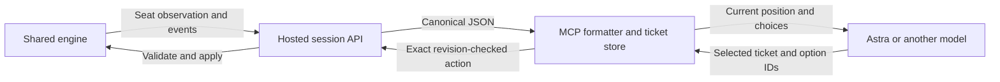

# Model-facing bot interface

Status: draft proposal. The compact decision view, action tickets, and protocol
skill below are not implemented. The existing
[hosted sessions and MCP adapter](../bot-sessions.md) provide the foundation.

## Problem and intended behavior

An agent should spend its effort deciding how to play. Today the MCP playing
view can also require it to apply JSON patches, join object and definition IDs,
look up card text, and repeat transport fields in each command. The playtest
additionally invoked MCP through generated shell/Python relay calls.

Add a deterministic presentation and command-translation layer to
`tools/penta-mcp`. Present the current position with named objects and exact
choices; accept a short reference to the selected choice. Preserve Astra's
reasoning effort and every genuine gameplay decision. The same interface
should work for other models.

The recorded three-game Greer G/R Aggro versus Briksza Naya Midrange match took
103.3 minutes before forced advancement. About 101.6 minutes elapsed between
delivery of a ready position and the acting agent's next submission, excluding
its HTTP requests. This includes model generation and Codex orchestration;
the traces do not isolate inference time. These observations motivate the
proposal, but do not establish its token or latency savings.

## Boundary and ownership



The engine remains authoritative for legality, state changes, and forced
continuations. The adapter owns formatting, public catalog caching, references,
and request bookkeeping. It does not rank actions, infer an intended move,
choose payment alternatives, or call another model to summarize the game.

Use the session's already-redacted observations and updates. Do not read
opponent credentials, reconstruction internals, or the omniscient event stream
to enrich the model's view. Existing human browser clients continue using the
same authoritative room without adopting this presentation.

## 1. A compact current-position view

Add an opt-in `presentation: "decision-v1"` argument to `attach`. Keep the
existing exact JSON presentation as the default until evaluation supports a
change. The HTTP observation contract remains unchanged.

Keep existing `ready`, `waiting`, and `complete` status semantics. Waiting
responses expose no new revision, view, or count of private opponent choices.

The adapter already receives complete canonical observations. Keep that state
outside the model and render a current-position view at every real choice.
If a future transport supplies deltas, apply them inside the adapter. The
agent should not need an earlier JSON patch baseline to interpret this view.

Use a fixed section order:

| Section | Contents |
| --- | --- |
| Situation | Seat, active player, priority, game and match score, phase/step, and the engine's distinct turn counters |
| Players | Life, mana, poison, energy, other counters, and hidden-zone counts |
| Position | Own hand, battlefield by controller, stack with explicit resolution order, public zones, emblems, and other observed state |
| Changes | Ordered seat-visible events and skipped inspection results from the existing update window |
| Choices | Every legal action or decision selection schema, in engine order, with exact references |
| References | Card text, oversized sections, and exact details available for this view |

Render object IDs together with names. For example, a battlefield row could be
`#343 Strangleroot Geist: 3/2; untapped; +1/+1 counter x1`. These are current
engine observations, not a recalculation from printed power and toughness.
Keep IDs distinct for different copies, and never carry identity across zone
changes unless the receiving observation explicitly supports that relation.
Printing definitions use canonical UUID strings; they are separate from
numeric game-object IDs and action/option indices.

Use a documented, versioned field mapping. Ordinary defaults can have compact
representations, but absent, false, zero, null, and an empty collection must
remain distinguishable wherever the canonical schema distinguishes them.
Only collapse duplicate fields when their equality is an established contract.
Display all exceptional state, including counters, chosen values, combat
assignments, copied characteristics, face-down status, and physical face state.
Retain unhandled fields in an explicit exact-details block. Unknown action
variants use an exact representation until a complete label is available.

Remove presentation-only art metadata from the ordinary playing view, and
move protocol provenance and reconstruction data to explicit references.
The adapter must still check compatibility. Raw observation and checkpoint
inspection remain available.

For oversized positions or menus, include counts and revision-bound page
references. Every entry remains addressable in its original order; no
relevance filter decides which choices exist. A reference resolves against the
frozen view that issued it, or returns an expired-view error. It must never
silently return entries from a different position. `next(full: true)` rebuilds
the complete current presentation, including its references.

Event rendering preserves ordering and multiplicity. It must retain a card
revealed into a hand and information from a forced private inspection even
when neither appears in the final board. Keep known or last-seen hidden-zone
information explicitly historical; do not upgrade it to current knowledge.
Reading or formatting a view must not consume the session's update window.

## 2. Descriptive choices and short action tickets

Each legal action receives a concise description and an opaque ticket. Labels
join only seat-visible objects with their names and exact engine fields.
Include source and targets, mode and X choices, cast/play alternatives,
sacrifices, and any represented payment distinctions. When a label cannot
express a distinction completely, attach exact details to that choice.
Two same-named actions must remain distinguishable and separately selectable.

Illustrative excerpt from a larger menu; ticket strings are examples:

```text
k7r42a6  Play Stomping Ground #331
k7r42a7  Play Forest #339
k7r42a8  Cast Strangleroot Geist #350
```

Add a `choose` MCP tool. For one concrete action:

```json
{"ticket":"k7r42a8"}
```

For a decision template, require the exact selected option IDs:

```json
{"ticket":"k7r42d0","options":[4,2]}
```

The decision view includes minimum and maximum selections, ordering semantics,
cancellation, and exact option IDs. A decision marker is not a single concrete
action. Omission of `options` is an error for such a ticket, even when an empty
selection is legal. Optional mana actions and all other real alternatives
remain visible. Sole continuations use the existing engine classification.

### Ticket lifecycle and errors

The adapter stores a bounded mapping from ticket to assigned connection/seat,
canonical revision, original action index and complete action, or decision
schema. An action ticket denotes that exact choice, not a label parsed back
into a move. Ticket namespaces must distinguish simultaneous connections and
games.

On `choose`, resolve the ticket, validate its input shape, generate the request
ID, and submit through the existing revision-checked HTTP play operation.
For a concrete action, submit its stored index with the stored revision; for
a decision, submit its decision ID and the model's exact option IDs. The
engine validates again. Return the next decision view using the existing
play-and-wait behavior. Connection handles and revisions need not be copied
into every successful model command.

Retain the exact submitted body before I/O. A repeated identical submission
for the retained ticket reuses its request ID; it cannot apply the move twice.
An uncertain result blocks different plays until the existing retry path
resolves it. After success, old tickets cannot start another move. The retained
last submission can still recover its receipt until superseded; do not imply
indefinite replay protection for evicted tickets or receipts.

Expired or unknown tickets, mismatched selections, and stale server revisions
return explicit errors with a resynchronization instruction. Never reinterpret
an old list index against the new menu or repair an ambiguous selection. A
process restart loses local tickets; reattach and obtain fresh ones. Recovery
of an uncertain request across process loss retains the existing requirement
to persist its exact body and ID.

Keep `play` and its exact explicit batches for existing clients. The first
ticket implementation accepts one concrete choice or one decision selection
per call. It does not expand a requested attack or spell into additional
agent-chosen actions. Engine-forced advancement remains unchanged.

## 3. Exact card and ability references

Use the cached public catalog to attach rules text to newly encountered visible
definitions and to label printed abilities by their actual origin. Include
inline token and emblem characteristics where the observation supplies them.
Use clear provenance: printed reference text, current observed characteristics,
and known modifications are different facts.

Do not present printed text as a complete effective rules description after a
copy, transformation, or text-changing effect. If the shared observation lacks
information needed to explain a changed ability, preserve the available exact
fields and identify that limitation. Any new effective-rules data belongs in
a separate shared observation capability, not a JavaScript rules evaluator.

Each view includes a rules-reference index for visible cards and abilities.
First-seen or changed reference text can be included inline within a size
budget; every omitted body gets an explicit lookup reference. A cached body
is not evidence that it is still in the model's context. Full refresh provides
the same index and current lookup access, and may resend requested bodies.

Never use catalog access to identify an opponent's face-down object or infer
which registered deck it came from. Inspection respects the same seat
projection as ordinary play.

## 4. Direct MCP use and a small protocol skill

Use the [existing stdio registration](../bot-sessions.md#run-locally) so pilots
invoke tools directly. Verify the actual pilot task has discovered them before
starting a timed match. Do not count a Python/shell relay run as a direct-MCP
measurement. Where the host cannot expose the server to a pilot, record that
limitation and retain a separate baseline for that route.

A future repository skill should explain only operation of the interface:

- Attach with the assigned seat credential and request `decision-v1`.
- Read the current position, updates, and choice bounds. Inspect referenced
  details when needed; IDs identify specific objects and options.
- Submit the selected ticket, including ordered option IDs when required.
- Use `next` for waiting and full refresh; resolve uncertain submissions with
  retry before making another move.
- Report interface errors or engine discrepancies with the visible view and
  ticket context, without placing credentials in the report.

Keep strategic advice and mandatory per-move explanations out of this skill.
The model's normal response is the selected tool call; optional commentary and
bug reports remain possible. This proposal does not lower reasoning effort or
impose a smaller reasoning budget.

## Compatibility and implementation sequence

Version `decision-v1` independently of canonical bot JSON. Changes confined to
MCP presentation and ticket resolution need no engine protocol, checkpoint, or
journal bump. See [compatibility boundaries](../interfaces.md#compatibility-boundaries).
Explicitly version or negotiate any later change that reinterprets an existing
presentation field. The canonical fallback remains usable throughout rollout.

Implement in three independently reviewable increments:

1. **Position formatter:** add the opt-in view, descriptive choices, exact
   field fallback, and frozen inspection references under `tools/penta-mcp`.
2. **Ticket submission:** add bounded ticket storage and `choose` while reusing
   `SessionClient` revision checks and uncertain-request handling.
3. **Pilot integration:** add the protocol skill, verify direct tool discovery,
   and run controlled comparisons before selecting a default presentation.

Prefer focused formatter and ticket modules over expanding `client.mjs` with
unrelated responsibilities. No rendered browser change is required by this
proposal. It does not require another session server or a model proxy.

## Validation and measurement

First establish correctness with fixtures covering action and decision forms,
using captured positions and focused synthetic edge cases:

- Every non-presentation canonical field is represented by the versioned
  mapping or exact fallback, including exceptional and unknown fields.
- Every concrete legal action has exactly one distinct ticket, resolving to
  its original action. Decision templates preserve their entire selection
  space rather than enumerating or collapsing combinations.
- Default-valued field removal, array order, distinct same-named objects,
  alternate costs, payment options, target groups, and ordered selections
  retain their meanings.
- Paging stays bound to the issuing view. Refresh and context loss preserve
  access to rules, choices, and historical disclosures.
- Private inspections, public notices, face-down objects, and last-seen cards
  preserve their information boundaries, including after reconnect.
- Stale tickets, duplicate submissions, changed option lists, storage/network
  failures, concurrent connections, and restart recovery cannot apply an
  unintended or duplicate move.

Use the existing MCP adapter tests as the owning lane. Exercise the hosted
session recovery tests only where ticket integration changes that behavior;
the canonical engine and browser contracts remain independently authoritative.

Then compare presentation and invocation changes separately. Use the same
captured decision positions for repeated, randomized-order model trials at
Astra Medium, with equal visible information and equivalent history access.
Measure delivered input tokens, generated output tokens, decision latency,
extra inspection calls, rejected/ambiguous selections, and factual state-reading
errors. Identical move choices are not required: different legal moves can be
reasonable. Where play quality is evaluated, record it separately from interface
correctness and do not introduce move recommendations into the formatter.

Run full matches only after the fixture and decision trials pass. Hold decks,
seed, engine fingerprint, model/effort, forced advancement, host, and invocation
route fixed within each comparison; repeat enough games to report variability.
Record setup separately, and measure engine work, transport, observation
delivery, and model submission boundaries without double-counting opponent
long polls. Keep output generation, reasoning, and orchestration time separate
where the host exposes them; otherwise report their combined measurement.

Compare the current exact-delta view against `decision-v1` on the same direct
MCP route, then isolate the effect of direct invocation versus the historical
relay. Report character reductions only as payload measurements, not token or
wall-clock savings. The previous 1,039-to-424 forced-action replay is an
independent interaction-count reduction, not this proposal's baseline speedup.

OpenAI's [latency guidance](https://developers.openai.com/api/docs/guides/latency-optimization)
supports testing shorter generated commands and fewer round trips. It does not
establish an Astra-specific gain for this format. Choose the default only after
the measurements show a benefit without information loss or additional errors.
