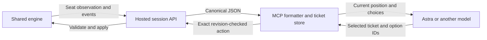

# Model-facing bot interface

Status: implemented as opt-in MCP presentation `decision-v1`. The existing
exact presentation remains the default pending controlled model evaluation.
See [bot sessions and MCP](../bot-sessions.md) for setup, tools, and recovery.

## Problem and boundary

The exact-delta playing view can require an agent to apply JSON patches, join
object and definition IDs, look up card text, and repeat transport fields in
each command. The historical playtest also generated shell/Python relay calls.
The adapter now keeps current canonical state outside the model, presents named
objects and exact choices, and accepts a short ticket for the chosen action.

The engine owns legality, state changes, and forced continuations. The adapter
owns formatting, public catalog caching, frozen references, and request
bookkeeping. It does not rank actions, infer intended moves, choose payments,
or invoke a model to summarize state. The shared room continues to support
human browser commands and external bots in either seat.

Only canonical seat observations and their redacted updates enrich the view.
The adapter never opens opponent credentials, reconstruction internals, or an
omniscient event stream to improve its labels or card references.

## Versioned position mapping

[`decision-view.mjs`](../../tools/penta-mcp/decision-view.mjs) implements the
following mapping for session API 1 and bot protocol 32. A future incompatible
mapping needs a new presentation version; the canonical protocol, checkpoint,
and replay schemas are unchanged by this layer.

| Section | Canonical contents |
| --- | --- |
| `situation` | `seat`, `activeSeat`, `prioritySeat`, `turn`, `activeTurn`, `phase` if present, `step`, `pregame`, `match`, `regularCombatDamagePending`, `result` |
| `players` | `life`, `manaPools`, `poison`, `energy`, `playerCounters`, `monarch`, `opponentHandSize`, `librarySizes`, `faceDownExileSizes` |
| `position` | `hand`, `battlefield`, `stack`, `graveyards`, `exiles`, `emblems`, `companions`, `cardCounters`, in original engine order |
| `updates` | Ordered public events and skipped private inspection information; duplicates are retained |
| `choices` | All legal actions with exact fields, descriptive labels, and tickets |
| `decision` | Entire selection schema, including original option IDs, bounds, ordering and cancellation |
| `facts` | Every remaining field, including historical disclosures and unknown future fields |
| `rules` | Visible definition index, printed reference bodies and explicit lookup handles |
| `provenance` | Reference to protocol version/capabilities, engine version, fingerprint, format and checkpoint |

Player arrays retain `[p1,p2]` indexing. The stack remains bottom to top.
Object IDs and canonical UUID printing definitions remain distinct. Labels use
current visible objects before historical knowledge; copied names cannot be
overwritten by an old disclosure. Current characteristics, counters, targets,
chosen values, physical faces, and exact ability origins stay intact. Printed
rules are explicitly reference material, not computed effective rules.

[`decision-format.mjs`](../../tools/penta-mcp/decision-format.mjs) factors
fields only when they are present and exactly equal in every row and the result
is shorter. A `{shared, rows}` table is self-contained: shared fields apply to
every row, with no prior view required. Missing, null, false, zero, empty arrays,
and empty objects stay distinct. This is field factoring, not equivalence
inference or strategic grouping. Known CardArt metadata is omitted; unfamiliar
fields, including unfamiliar `art` shapes, survive. Full exact inspection is
still available.

Sections exceeding 100 entries or 12,000 JSON characters use explicit counts
and opaque references. `inspect_ref` reads the frozen issuing view in engine
order with optional caller-requested filtering. It never substitutes the latest
position. Pages respect a 24,000-character budget except that a single larger
item is returned intact so the cursor can progress. Full refresh creates fresh
references and expires prior ones. Waiting retains the last safe inspection
view, disables its actions, and reveals no opponent revision or choice count.

Card text is cached from the public catalog and joined only to definitions
already present in the seat observation outside the checkpoint. Catalog
protocol/fingerprint mismatches prevent those joins. First-seen or changed
printed text is included within a 12,000-character inline budget; omitted
bodies remain explicitly inspectable. Full refresh resends text within that
budget. Unavailable catalog entries remain explicit, and catalog failure cannot
turn an accepted move into an uncertain submission.

## Exact tickets and bounded recovery

Each current-view ticket identifies its connection, revision and original
concrete action index, or the complete decision schema. Labels never parse back
into moves. Same-named actions remain separate, with their distinct exact
payment, mode, X, target, and ability fields beside them.

`choose({ticket})` submits one stored action index. Decision tickets require
`choose({ticket, options:[...]})`, using actual option IDs in model-selected
order. Empty selections must be explicit. The adapter checks IDs, uniqueness
and bounds; the engine validates again. Optional mana actions and every other
real alternative remain selectable. Only the existing engine classification
advances forced continuations.

[`client.mjs`](../../tools/penta-mcp/client.mjs) records the exact body and a
request ID before I/O. It serializes state-changing/read-and-refresh calls per
connection. An uncertain result blocks other plays. An identical retained
ticket reuses its request ID, including after success; it cannot apply twice.
`retry` uses the same retained body. Definite stale or validation errors clear
the uncertain request but leave old actions disabled until refresh.

Storage is bounded to the current frozen view, catalog/seen-rule cache, and
latest submitted ticket per connection. Submitting a newer command evicts the
older receipt ticket. Expired tickets or changed selections fail explicitly;
there is no automatic repair or index reinterpretation. Restart loses local
tickets. Cross-process uncertain-request recovery keeps the existing requirement
to save the exact request body and ID. Explicit `play` and its exact batches
remain available.

## Direct pilot integration

The stdio entry point resolves its own worktree's development server URL, even
when launched from another directory. `PENTA_SERVER_URL` overrides it for other
deployments. The [stdio probe](../../tools/penta-mcp/probe.mjs) verifies tool
schemas/discovery and backend reachability without creating a match.

The [play-penta skill](../../.agents/skills/play-penta/SKILL.md) describes only
attachment, current views, choice IDs, references, waiting and recovery. The
normal move can be a direct tool call without mandatory narration. No model,
reasoning-effort, strategy or token-budget setting changes.

A pilot must separately discover the tools in its actual host. A successful
stdio client handshake is not evidence that an already-running task has native
Penta tools. Record a host-discovery limitation rather than counting a shell
relay as direct-MCP model validation.

## Validation and remaining measurement

The adapter tests cover exact choice preservation, unknown/default field
semantics, ordered selections, historical information, catalog provenance,
paging, expiration, multiple connections, stale revisions, uncertain writes,
concurrent calls, and real stdio tool invocation. The real WASM hosted-match test
combines tickets with human browser commands, sideboarding, room eviction,
idempotent receipts and deterministic replay.

The historical Greer G/R Aggro versus Briksza Naya Midrange match took 103.3
minutes before forced advancement. About 101.6 minutes elapsed from ready
position delivery to the agent's next submission, excluding its HTTP requests.
That combines model generation with Codex orchestration; it does not isolate
inference time. The separate 1,039-to-424 forced-action replay is an interaction
count reduction, not a measured speedup of this presentation.

Controlled Astra Medium evaluation remains open. Compare identical captured
positions on the same direct MCP route, randomized in order, with equivalent
history access. Measure delivered input/output tokens, decision latency, extra
inspection calls, rejected selections and factual state-reading errors. Full
matches should hold decks, seed, engine fingerprint, model/effort, forced
advancement, host and route fixed, with repeated trials to report variability.
Measure setup separately and avoid double-counting opponent long polls.

Use `tools/penta-mcp/measure-trace.mjs` for offline JSON payload comparisons.
Character counts exclude tool schemas, inspections and reasoning; they are not
token or wall-clock measurements. A current-position packet can be larger than
an exact delta while requiring less reconstruction by the model. Neither a
payload reduction nor reduced inference time is assumed.

OpenAI's [latency guidance](https://developers.openai.com/api/docs/guides/latency-optimization)
supports testing shorter generated commands and fewer round trips. It does not
establish an Astra-specific gain for this format. Keep the presentation opt-in
until controlled measurements establish a benefit without lost information or
additional errors.
